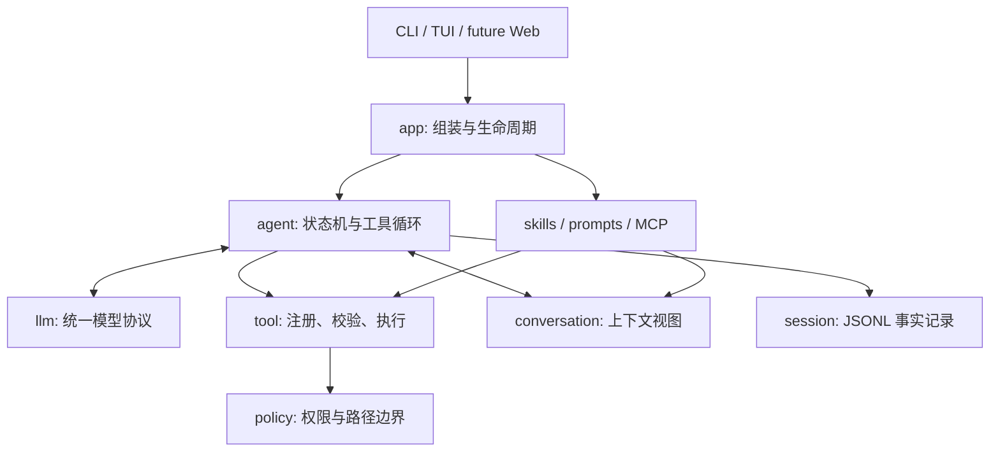

# Drift 架构与当前边界

> 状态：已按 M1.10 对齐 ｜ 更新：2026-10-01

本文说明 Drift 的长期分层和当前安全边界，交付范围及验收标准以 [spec/current.md](../spec/current.md) 为准。运行方法见 [README](../README.md)。

## 1. 结论

Drift 建议定位为一个 **小内核、事件驱动、可嵌入的 Go Coding Agent Runtime**，而不是直接复制 FoxCode 的全部能力。

- 学 Pi：把模型适配、Agent Loop、交互层拆开；默认工具少；扩展能力尽量放在核心之外。
- 学 FoxCode：统一 Provider 事件、工具注册与权限检查、会话落盘、上下文压缩，以及 Go 下清晰的 `internal` 包边界。
- Drift 自己的取舍：先做单进程、单 Agent、单 Go Module、单二进制；先打通 CLI 纵向链路，再按真实需求增加交互和扩展能力。

当前 M1.x 的核心链路是：

```text
用户输入 -> Agent Loop -> LLM Stream -> 原生只读 Tool Call -> Tool Execute
        <- Event Stream <- Tool Result <- 会话追加落盘 <----------------+
```

## 2. 设计原则

1. **核心不依赖 UI**：TUI、print、未来 Web 都只消费同一组 Runtime Event。
2. **协议归一化**：Provider 差异止于 `llm` 包，Agent 只认识 Drift 自己的消息和事件。
3. **能力通过组合加入**：工具、Provider、Session Store 在启动层组装，不在 Agent Loop 里硬编码。
4. **默认能力最少**：当前只提供 `list_files`、`search_text`、`read_file` 三个只读工具。
5. **当前版本只读**：M1.x 不写文件、不删除文件、不执行命令；写入或执行若未来重新提议，必须先设计独立的权限、审计和回滚边界。
6. **状态可审计**：会话使用 append-only JSONL；即使压缩上下文，也保留原始记录。
7. **先标准库，后依赖**：协议、配置和测试优先使用标准库；真实 TTY 输入只引入 Bubble Tea/Bubbles，Provider 适配仍保持轻量。

## 3. 总体分层



依赖只能从外向内：

```text
cmd -> app -> ui
          -> agent -> llm
                   -> tool -> policy
                   -> conversation
                   -> session
```

`llm`、`tool`、`session` 不得反向依赖 `agent` 或任何 UI 包。

## 4. 建议目录

下面是目标框架，不要求第一天创建所有空目录；跟随里程碑逐步落地。

```text
drift/
├── cmd/
│   └── drift/
│       └── main.go                 # 只解析参数、处理退出码、调用 app.Run
├── internal/
│   ├── app/
│   │   ├── app.go                  # Composition Root，组装全部依赖
│   │   └── lifecycle.go            # 启停、signal、graceful shutdown
│   ├── agent/
│   │   ├── agent.go                # 最小 Agent Loop
│   │   ├── event.go                # Runtime 对 UI 的稳定事件
│   │   └── executor.go             # Tool Call 调度；先串行，必要时再并发
│   ├── llm/
│   │   ├── client.go               # Client、Request、Message、StreamEvent
│   │   ├── model.go                # Model/usage/stop reason 等统一类型
│   │   ├── openai/
│   │   │   └── client.go           # 第一优先：OpenAI Compatible
│   │   └── anthropic/
│   │       └── client.go           # 第二个 Provider，用于验证抽象
│   ├── conversation/
│   │   ├── conversation.go         # 当前分支的模型上下文
│   │   └── compact.go              # 第二阶段加入压缩策略
│   ├── tool/
│   │   ├── tool.go                 # Tool 接口、Call、Result、Risk
│   │   ├── registry.go             # 注册、查找、schema 输出
│   │   └── builtin/
│   │       ├── read.go
│   │       ├── write.go
│   │       ├── edit.go
│   │       ├── exec.go
│   │       └── search.go
│   ├── policy/
│   │   ├── policy.go               # allow / ask / deny
│   │   └── path.go                 # workspace 路径边界与 symlink 检查
│   ├── session/
│   │   ├── session.go              # Session/Entry 数据结构
│   │   └── jsonl.go                # append、load、list
│   ├── prompt/
│   │   └── prompt.go               # 系统提示词与 AGENTS.md 上下文组装
│   ├── config/
│   │   └── config.go               # 全局 + 项目 + 环境变量覆盖
│   ├── resource/                    # 第三阶段再创建
│   │   ├── skills.go               # Markdown Skill 发现与加载
│   │   └── prompts.go              # Prompt 模板发现与加载
│   ├── mcp/                         # 第三阶段再创建
│   │   └── client.go               # MCP 工具转换为 tool.Tool
│   └── ui/
│       ├── print/
│       │   └── print.go             # 第一版，非交互/流式终端输出
│       └── tui/                     # 第二阶段再创建
│           ├── model.go
│           └── view.go
├── doc/
│   └── architecture.md
├── testdata/                        # 只在确有跨包 fixture 时创建
├── .drift.example/
│   └── config.json
├── go.mod
├── go.sum
└── README.md
```

### 为什么不建 `pkg/`

第一版 API 还不稳定，全部放在 `internal/` 可以避免过早背负兼容性。真正出现“其他 Go 程序要嵌入 Drift”的需求后，再把稳定的 `agent`、`llm` 公共类型提升到根级公开包。

### 为什么不用 Go Plugin

Go 原生 `plugin` 的平台和版本约束不适合跨平台 CLI。Drift 的运行时扩展优先采用：

- Skills / Prompts：普通 Markdown 文件；
- 外部工具：MCP 或独立进程协议；
- 内建能力：编译期注册的 Go 工具。

这样 Windows、macOS、Linux 的行为更一致，也不把任意动态代码加载进主进程。

## 5. 核心契约

接口保持少而稳定，定义在使用方所在的包，不先建立一套“大而全”的抽象层。

```go
// llm
type Client interface {
    Stream(ctx context.Context, req Request) (<-chan StreamEvent, <-chan error)
}

// tool
type Tool interface {
    Name() string
    Schema() json.RawMessage
    Risk(args json.RawMessage) Risk
    Execute(ctx context.Context, args json.RawMessage) Result
}

// agent -> UI
type Event struct {
    Type EventType
    Text string
    Tool *ToolEvent
    Usage *Usage
    Err error
}
```

不建议为每一种事件定义大量空方法类型。一个带枚举的事件结构已经足够支撑 CLI/TUI，等真实消费者证明需要更强类型后再拆。

## 6. 一轮执行流程

1. `app` 加载配置、项目规则、Provider、Session Store 和工具注册表。
2. UI 把用户输入交给 `agent.Run`。
3. Agent 从 conversation 生成 LLM Request，并开始消费统一流事件。
4. 文本增量立即转成 Runtime Event；完整 Tool Call 收齐后再执行。
5. 每个 Tool Call 先解析参数，再由 policy 返回 `allow / ask / deny`。
6. Tool Result 先追加到 JSONL，再加入 conversation，随后进入下一轮模型请求。
7. 没有工具调用、被取消或发生不可恢复错误时结束本轮。

第一版所有工具调用保持串行。只有 profiling 证明慢，并且已经能可靠区分只读与有副作用工具后，才并发只读调用。

## 7. 技术栈建议

| 领域 | 选择 | 说明 |
| --- | --- | --- |
| 语言 | Go 1.26+ | 当前开发环境可直接使用；CI 同时验证当前稳定版 |
| CLI | `flag` + `os/signal` | 先不引入 Cobra |
| HTTP / SSE | `net/http` + `bufio` | OpenAI Compatible 可先用标准库实现 |
| 日志 | `log/slog` | 结构化、标准库自带 |
| 配置 | `encoding/json` | `.drift/config.json`，避免先引入 YAML/TOML 依赖 |
| 会话 | JSONL + 原子文件操作 | 可读、可迁移、适合 append-only |
| TTY 输入 | Bubble Tea + Bubbles | M1.8 已用于单行输入、占位符、光标和取消反馈 |
| Markdown | Glamour | 只在 TUI 确实需要渲染时加入 |
| MCP | 官方 Go SDK | 第三阶段加入，不进入第一版核心链路 |
| 测试 | `testing` + `httptest` | Provider 用假 SSE Server，Agent 用 fake Client |

Provider 层可以使用官方 SDK，但不要让 SDK 类型越过 `internal/llm/<provider>` 的边界。若 OpenAI Compatible 的第一版协议很小，标准库实现通常更容易控制和测试。

## 8. 配置与本地状态

建议按以下优先级合并：

```text
命令行参数 > 环境变量 > .drift/config.json > ~/.drift/config.json > 默认值
```

本地状态建议：

```text
.drift/
├── config.json             # 项目配置，可选择提交 example
├── sessions/               # JSONL 会话，不提交
├── cache/                  # 可删除缓存，不提交
└── tmp/                    # 大工具结果等临时内容，不提交
```

密钥只从环境变量或系统凭据存储读取，不写入 session、日志或项目配置。

## 9. 交付顺序

### 已完成：M0～M1.10

- 已完成 workspace/focus、只读多轮探索、分页读取、Trace、脱敏审计、交互式 chat、完整会话恢复、会话生命周期管理、上下文压缩和 `/status` 状态面板。
- 当前支持 OpenAI Compatible 与可选 Anthropic Messages 两个 Provider，二者都归一化为同一套消息、事件和工具协议；工具仍固定为三个只读工具。
- 真实 TTY 会消费 Agent 的工具事件显示安全进度摘要，完成标记使用 ASCII 英文 `Done`；非 TTY 协议不变。

### M1.5：运行时卫生与边界对齐

- 发现遍历跳过 `.worktrees` 和 `.codex-temp`，避免旧 worktree 与构建缓存进入模型上下文。
- 所有无原生工具调用的最终文本都检查 DSML/伪工具格式。
- 架构文档与当前“只读 Runtime”身份保持一致。

### 后续候选，不属于当前 M1.x

- 完整 TUI、多行编辑和输入队列；
- Skills、MCP、Project Trust、写入/命令执行能力。

### M2：可扩展

- Skills 与 Prompt 模板；
- MCP 工具接入与按需 schema 加载；
- Project Trust；
- hooks，但只开放已出现真实需求的生命周期事件。

### M3：按需求验证后再做

- Remote Web / RPC；
- 多 Agent 与 worktree 隔离；
- 长期记忆；
- 后台任务；
- 对外 Go SDK。

这些能力复杂度高，而且彼此耦合，不应在核心闭环完成前并行建设。

## 10. 验收边界

当前版本至少满足：

- UI 不导入任何具体 Provider 包；
- Agent 不包含 OpenAI/Anthropic 专有字段；
- 不存在写文件、删除文件或命令执行入口；
- Tool Result 在加入下一轮上下文前已经持久化；
- `go test ./...` 和 `go vet ./...` 通过；
- 断网时仍能读取历史会话和执行纯本地命令。

## 11. 参考与取舍

- [Pi 仓库](https://github.com/earendil-works/pi)：拆分 AI API、Agent Core、Coding Agent、TUI 四类职责。
- [Pi Coding Agent](https://github.com/earendil-works/pi/tree/main/packages/coding-agent)：默认仅少量工具，采用扩展、Skills、Prompts 和包系统承载额外工作流。
- [Pi Agent Core](https://github.com/earendil-works/pi/tree/main/packages/agent)：AgentMessage 与 LLM Message 分离，并以事件流连接上层应用。
- [FoxCode](../../foxcode/README.md)：参考其 Go Provider、工具注册、上下文治理、权限和会话工程经验；不照搬其已成熟后的包数量。
- [Go Release History](https://go.dev/doc/devel/release)：确认 Go 版本支持范围。

当前决策可以概括为一句话：**先把 Drift 做成一个安全、可审计、只读的本地 Runtime；任何有副作用的能力都不从旧草案直接继承。**
