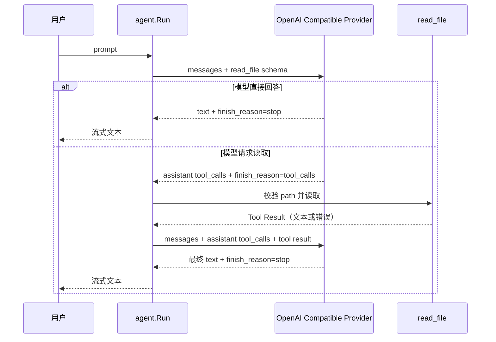

# M0.2：只读 Agent Loop 设计

> 状态：已确认，待实现｜更新：2026-09-10

## 目标

在现有单次流式对话之上，完成一个真实的只读 Agent 闭环：模型可以选择调用 `read_file`，Drift 在当前工作目录内读取文件，将结果以 Tool Result 回传给模型，再由模型输出最终回答。

验收示例：

```powershell
go run ./cmd/drift -p "解释 README.md 的项目作用"
```

模型应自行请求 `read_file({"path":"README.md"})`，最终在 stdout 给出解释。

## 范围

本阶段只实现以下能力：

- 一个原生 OpenAI Compatible Function Tool：`read_file`；
- 每次用户任务最多一个 Tool Call，最多两次模型请求；
- workspace 内普通文件读取；
- Tool Call、Tool Result 和最终文本的流式协议处理；
- OpenAI Compatible 适配器对 DeepSeek `reasoning_content` 的回放。

本阶段明确不实现：工具注册表、`search`、`write`、`edit`、`exec`、权限交互、会话落盘、并发工具、多 Agent、TUI、MCP 和多 Provider。

## 选择与理由

采用模型原生 Function Tool Call，而不要求模型从普通文本中输出 JSON。DeepSeek 的 OpenAI Chat Completions 接口支持 `tools`、`tool_calls` 和 `tool` 消息；参数仍必须由客户端验证。[DeepSeek Tool Calls](https://api-docs.deepseek.com/guides/tool_calls/) [DeepSeek Chat Completions](https://api-docs.deepseek.com/api/create-chat-completion/)

只提供一个工具且只允许一次调用，足以验证 Agent 的完整控制流。暂不建立 `Registry` 或通用 `Tool` 接口：它们在只有一个工具时只会增加间接层。第二个工具实际出现时，再从 `read_file` 的接口抽出共用契约。

## 运行流程



第一轮不立即向 stdout 写文本。只有确认 `finish_reason=stop` 时才输出第一轮文本；若第一轮选择工具调用，就丢弃其文字前缀。第二轮的文本增量立即输出。这样避免终端出现“我来读取文件……”后又重复一遍最终答案。

## 协议和数据结构

现有 `llm.Client.Stream` 从“只回调文本”升级为“回调统一流事件，并返回完整 Assistant Message”。不引入 channel；同步回调继续让取消和输出错误直接回传。

```go
type ToolDefinition struct {
    Type     string          `json:"type"`     // 固定 "function"
    Function json.RawMessage `json:"function"`
}

type ToolCall struct {
    ID        string
    Name      string
    Arguments string // 模型输出的 JSON 字符串，尚未信任
}

type Message struct {
    Role             string
    Content          string
    ToolCalls        []ToolCall
    ToolCallID       string // role == "tool" 时必填
    ReasoningContent string // DeepSeek 思考模式的回放字段
}

type StreamEvent struct {
    Text             string
    ReasoningContent string
    ToolCallDelta    *ToolCallDelta
}

type ToolCallDelta struct {
    Index     int
    ID        string
    Name      string
    Arguments string
}

type Completion struct {
    Assistant    Message
    FinishReason string // "stop" 或 "tool_calls"
}

type Client interface {
    Stream(ctx context.Context, req Request, emit func(StreamEvent) error) (Completion, error)
}
```

`Request` 新增可选的 `Tools []ToolDefinition`。第一轮带一个 `read_file` schema；第二轮不带 tools，从协议层阻止第二次工具调用。

DeepSeek 在思考模式的工具调用后要求原样回传 `reasoning_content`；缺失会返回 400。因此 Provider 将每个 `delta.reasoning_content` 聚合进第一轮 assistant message，并在第二轮请求中序列化为 `reasoning_content`。其他 OpenAI Compatible 服务不产生该字段时会被 `omitempty` 忽略。[DeepSeek Thinking Mode](https://api-docs.deepseek.com/guides/thinking_mode/)

### read_file schema

```json
{
  "type": "function",
  "function": {
    "name": "read_file",
    "description": "Read UTF-8 text from one file inside the current workspace. Use a relative path.",
    "parameters": {
      "type": "object",
      "properties": {
        "path": {"type": "string", "description": "Relative file path"}
      },
      "required": ["path"],
      "additionalProperties": false
    }
  }
}
```

模型输出的 `arguments` 仍可能是错误 JSON 或含有额外字段。Drift 必须自己解析并校验，不能因为 schema 已发送给模型就信任输入。

## 文件读取边界

`read_file` 接收 workspace 根目录和模型给出的相对路径，返回给模型的内容不超过 128 KiB。

执行规则：

1. 拒绝空路径、绝对路径和包含 `..` 的逃逸路径。
2. 使用 `filepath.Abs` 和 `filepath.Rel` 确认目标仍在 workspace 内。
3. 对 workspace 和目标执行 `filepath.EvalSymlinks`，再次确认解析后的目标仍在根目录内，阻止已存在的软链接逃逸。
4. 只接受普通文件；目录、设备和不存在的文件返回工具错误。
5. 使用受限读取，超过 128 KiB 时返回工具错误，而不是把大文件塞入模型上下文。
6. 工具错误同样作为 `role: tool` 消息回传给模型，让模型解释失败或选择无需文件的回答。

128 KiB 是 M0.2 的上下文上限，不做截断。真正需要大文件时，下一阶段再加偏移量、行范围或 `search` 工具。

## Agent 决策

`agent.Run(ctx, client, root, prompt, emitText)` 持有本次任务的消息切片。

1. 以 user message 和 `read_file` schema 调用模型。
2. `stop`：流式输出并成功结束。
3. `tool_calls`：仅接受恰好一个、名称为 `read_file` 的调用；执行读取，并追加 assistant tool-call message 与 tool result message。
4. 再请求一次模型，不发送 tools。
5. 第二轮只有 `stop` 才算成功；若仍试图调用工具，返回明确错误。
6. 任何 context 取消、Provider 错误、输出错误或无法解析的流均终止任务。

`app.Run` 只负责构造 Provider、取得 `os.Getwd()` 作为 root、调用 Agent 并映射退出码。当前 `ui/print` 将删除：它只服务于旧的文本回调，Agent 接收 `emitText` 回调即可保持与 stdout 解耦。

## 文件改动

```text
创建  internal/agent/agent.go          Agent 两轮控制流
创建  internal/agent/agent_test.go     成功、工具错误、第二次调用和取消
创建  internal/tool/read.go            workspace 内文件读取
创建  internal/tool/read_test.go       路径、软链接、普通文件、128 KiB 边界
修改  internal/llm/client.go            Tool/Message/StreamEvent 协议
修改  internal/llm/openai/client.go     请求序列化和 SSE tool-call 聚合
修改  internal/llm/openai/client_test.go 协议回归测试
修改  internal/app/app.go               由 Agent 驱动 CLI
修改  internal/app/app_test.go          两轮端到端模拟服务测试
删除  internal/ui/print/print.go        被 Agent 的 emitText 回调取代
修改  spec/current.md                   M0.2 范围与验收标准
修改  doc/getting-started.md             使用与行为说明
```

## 验收

- 本地 `httptest` 服务验证第一轮 request 携带正确工具 schema。
- 流中分片的 `tool_calls.function.arguments` 能按 index 聚合。
- 第二轮 request 包含 assistant tool call 和相同 ID 的 tool result。
- DeepSeek `reasoning_content` 能进入第二轮 assistant message。
- 模型直接回答时只发生一次请求；成功读取时恰好发生两次请求。
- 缺失文件、非法 JSON、额外字段、非 `read_file`、多个调用、目录、软链接逃逸、超大文件和第二轮调用工具都可预测地失败或返回工具错误。
- `go test ./...`、`go vet ./...`、`go build ./cmd/drift` 通过。
- 手工用 DeepSeek 执行 `go run ./cmd/drift -p "解释 README.md 的项目作用"`，模型实际调用 `read_file` 并给出最终解释。

## 不变项

- 继续使用 Go 1.26+ 和标准库，不新增依赖。
- API Key 仍只从 `OPENAI_API_KEY` 环境变量读取。
- stdout 只输出最终模型文本；错误写 stderr。
- 单任务最大两次模型请求；不写入仓库文件。
